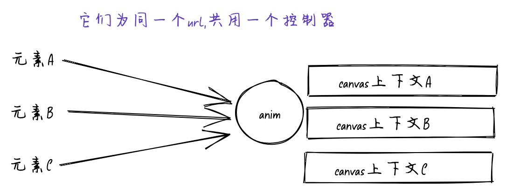

### 播放参数

| 参数名  | 数据类型 | 用途         | 默认值          |
| ------- | -------- | ------------ | --------------- |
| playNum | number   | 播放次数     | 0：表示循环播放 |
| rate    | number   | 播放速率     | 1               |
| keep    | boolean  | 是否需要复用 | false           |

在调用 `play()` 前调用 `setOptions()`

```js
anim.setOptions({
  keep: true,
  rate: 2,
  playNum: 1,
});
```

这里解释一下keep的作用,在播放结束的时候，默认会销毁canvas上下文,需要重新调用animateImage。keep可以保持上下文不被销毁。

#### 这样设计的原因:

当解析多个元素发现为同一个url的时候,默认会共用一个控制器生成多个canvas上下文。<br>
该api很有可能是写在组件内部,那么当父组件更新的时候 有可能会需要触发子组件更新导致重新执行api(:)当然不是一定这样)<br>
所以结束播放的时候自动清除了上下文以便下次的生成。<br>
keep可以保持上下文让你 不停的play & stop yoyoyo~~<br>

