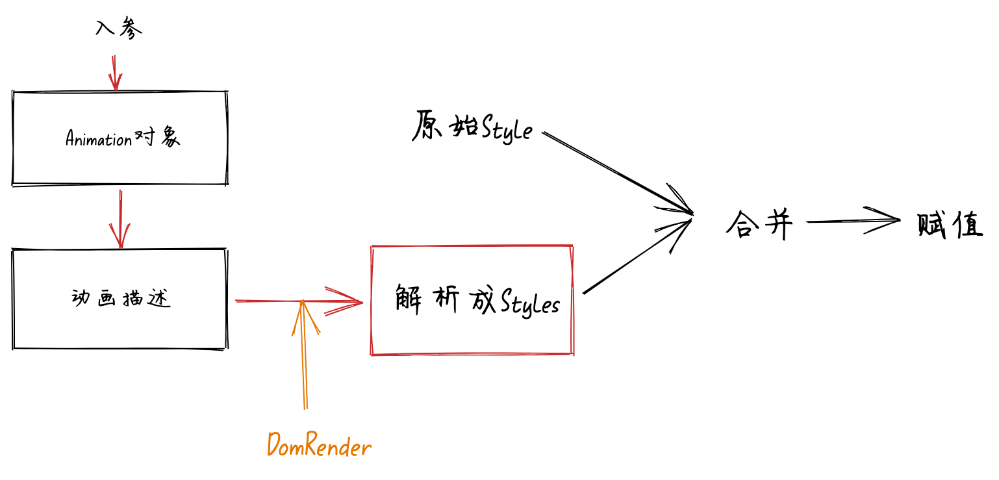

## 概述

用于 dom 操作执行动画的插件


## 安装

```shell
    npm install obisum --save
```

```shell
    npm install  --save
```

## 使用

可以认为 obisum 和 obisum-dom 之间的关系 类似于 React 和 React-dom

```js
import obisum from "obisum";
import DomRender from "obisum-dom";
obisum.use(DomRender);
obisum.get("#app").moveTo(100, 100);
```

详细的使用方式请参照 文档其余部分
