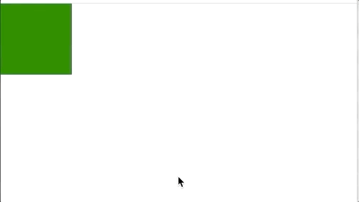

## 位移

示例图片<br>



### api 介绍

:small_orange_diamond: moveTo(x,y,duration)


|参数|类型|说明|默认值
|:---:|:---:|:---|:---:|
|x|number,string|可以是 number 默认单位'px' 可以是带单位的 string ex:'100vw'|
|y|number,string|可以是 number 默认单位'px' 可以是带单位的 string ex:'100vw'||
|duration|number|动画持续时间 单位ms|400|

:small_orange_diamond: moveTo(options)

|参数|类型|说明|默认值
|:---:|:---:|:---|:---:|
|x|number,string|可以是 number 默认单位'px' 可以是带单位的 string ex:'100vw'|
|y|number,string|可以是 number 默认单位'px' 可以是带单位的 string ex:'100vw'||
|duration|number|动画持续时间 单位ms|400|
|timeFunction|string|例如 'ease' 'ease-in-out' 等|'linear'|

### 示例代码

单个动画

```js
obiusm.use(ObiusmDom);
obiusm.get("#app2").moveTo(300, 300);
```

复杂动画

```js
obiusm.use(ObiusmDom);
let Animation = obiusm
  .create()
  .moveTo("100vw", "0")
  .moveTo(200, 200, 1000)
  .moveTo({ x: 0, y: 0, duration: 1000, timeFunction: "ease" });
let renderer = obiusm.dom(document.getElementById("app"), Animation);
renderer.render();
```
