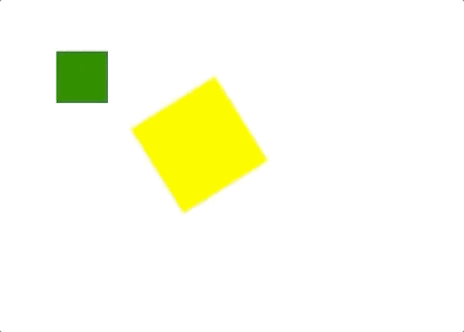

## 持续状态

示例图片



### api 介绍

statusOn(type,description,transformOrigin[可选])

- type: 种类 目前只支持 scale 和 rotate
- description: 描述 
    - rotate : 'z,infinite 0.2s linear' z是表示轴向 逗号后面的写法即css中的写法
    - scale : '1|1|0.5|0.5,infinite 1s linear alternate' 1|1|0.5|0.5 表示开始前后x,y方向的缩放系数 逗号后面的写法即css中的写法

statusOff(type) 取消持续状态

- type: 种类 目前只支持 scale 和 rotate

!> statusOn目前只支持单独出现 💣💣💣 后续会更新 

后续会补充更多便捷功能😬😬😬😬

### 示例代码

```js
    mot.use(DomRender);
    let Animation = mot
        .create()
        .statusOn('scale','1|1|0.5|0.5,infinite 1s linear alternate','100% 100%')
        ;
        console.log(Animation)
    let renderer = mot.dom(document.getElementById('app'), Animation);
    renderer.render()
    let Animation2 = mot
        .create()
        .statusOn('rotate', "z,infinite 0.2s linear",'50% 50%')
        .moveTo(150,100)
        ;
        console.log(Animation)
    let renderer2 = mot.dom(document.getElementById('app2'), Animation2);
    renderer2.render()
```
