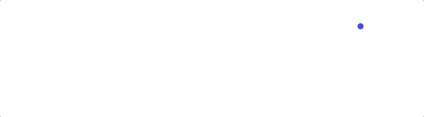

## 路径动画

输入坐标点可以生成平滑的曲线

### 图片示例



## 安装插件

```bash
npm i obiusm-plugin-path
```

需要挂载到主库先

```js
import PathPlugin from "obiusm-plugin-path";
obiusm.use(PathPlugin);
```

## api 介绍

path(points,options[可选])

- points: 顶点数组 ex:[{x:0,y:0}]
- options.precision: 某段曲线点的个数 默认 50
- options.ratio: 大概可以理解为曲线的弯曲程度 推荐 0.3 - 0.6 之间

!> 目前功能还比较简单 后续会补充 (灬 ꈍ ꈍ 灬)

## 示例代码

```js
import PathPlugin from "obiusm-plugin-path";
obiusm.use(PathPlugin);
obiusm.use(ObiusmDom);
let Animation = obiusm
  .create()
  .moveTo(100, 100, 400, "ease")
  .scale({ x: 1.1, y: 0.8, duration: 100, transformOrigin: "50% 100%" })
  .step([
    { action: "move", x: 200, y: 20 },
    { action: "scale", x: 1, y: 1 },
  ])
  .moveTo(300, 100, 400, "ease")
  .scale({ x: 1.05, y: 0.8, duration: 100, transformOrigin: "50% 100%" })
  .step([
    { action: "move", x: 400, y: 40 },
    { action: "scale", x: 1, y: 1 },
  ])
  .path(
    [
      { x: 400, y: 40 },
      { x: 500, y: 100 },
      { x: 600, y: 40 },
    ],
    { precision: 25 }
  );
console.log(Animation);
let renderer = obiusm.dom(document.getElementById("app"), Animation);
renderer.render();
```
