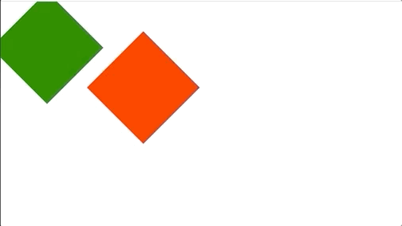

## 旋转

示例图片


### api 介绍

rotate(z,duration)

- z: 旋转角度
- duration: 持续时间

或者可以传入一个对象
attribute(options)

- options.key 属性
- options.value 值
- options.duration 动画时间
- options.timeFunction 例如 'ease' 'ease-in-out' 等
- options.transformOrigin 变换中心点位置

### 示例代码

```js
mot.use(DomRender);
let Animation = mot.create().rotate(45).rotate(90).rotate(135);
console.log(Animation);
let renderer = mot.dom(document.getElementById("app"), Animation);
renderer.render();
let Animation2 = mot
  .create()
  .rotate({ z: 45, transformOrigin: "100% 100%" })
  .rotate({ z: 90, transformOrigin: "100% 100%" })
  .rotate({ z: 135, transformOrigin: "100% 100%" });
console.log(Animation);
let renderer2 = mot.dom(document.getElementById("app2"), Animation2);
renderer2.render();
```
