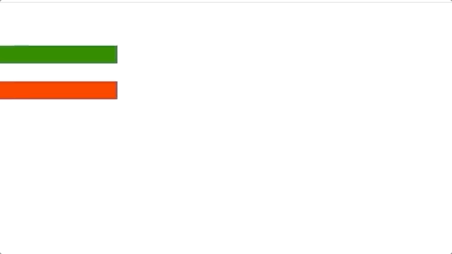

## 放大缩小

示例图片



### api 介绍

scale(x,y,duration)

- x: x 轴向
- y: y 轴向
- duration: 持续时间

或者可以传入一个对象
scale(options)

- options.x x 轴向
- options.y y 轴向
- options.duration 动画时间
- options.timeFunction 例如 'ease' 'ease-in-out' 等
- options.transformOrigin 变换中心点位置

### 示例代码

```js
obiusm.use(ObiusmDom);
let Animation = obiusm.create().scale(1.5, 0.2);
console.log(Animation);
let renderer = obiusm.dom(document.getElementById("app"), Animation);
renderer.render();
let Animation2 = obiusm
  .create()
  .scale({ x: 1.5, y: 0.2, transformOrigin: "50% 100%" });
console.log(Animation);
let renderer2 = obiusm.dom(document.getElementById("app2"), Animation2);
renderer2.render();
```
